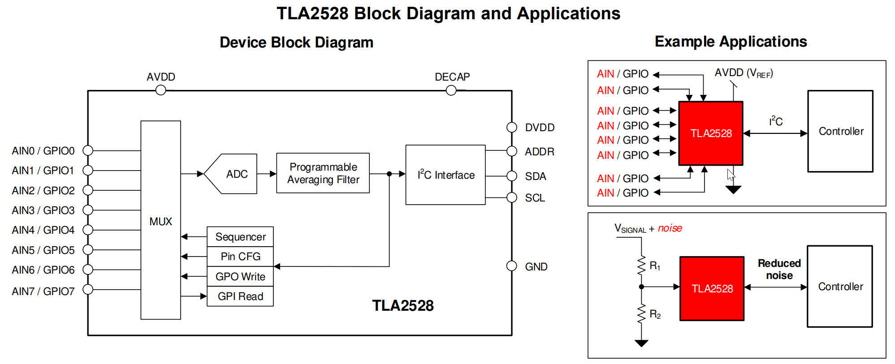
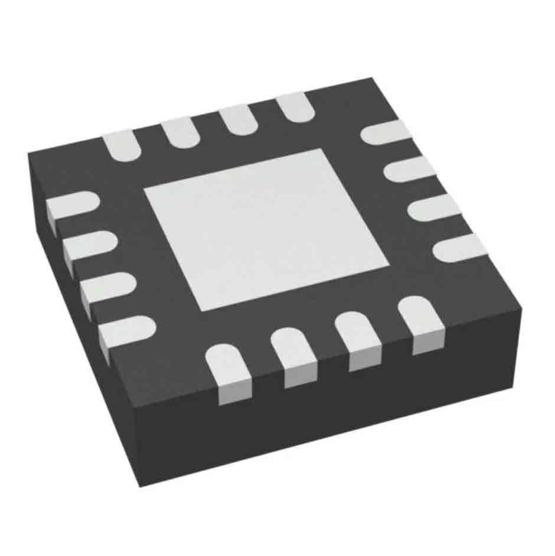
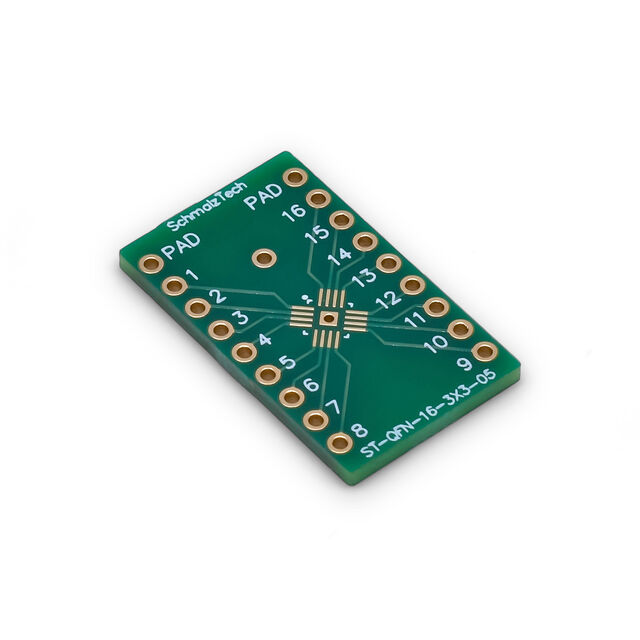
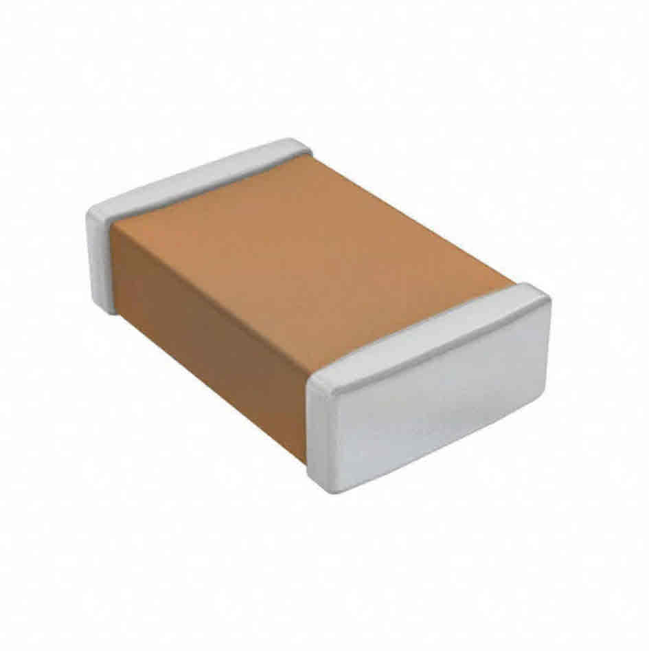

# TLA2528 Arduino Library


Arduino library for the Texas Instruments TLA2528 - an 8-channel, 12-bit ADC with GPIO and software PWM capabilities. Transform your I²C bus into a versatile I/O expansion system.

## ✨ Features

- **🎯 Simple Arduino-style API** - Familiar `pinMode()`, `digitalWrite()`, `digitalRead()`, `analogWrite()`, `analogRead()` functions
- **📊 12-bit ADC Resolution** - 4096 levels for precise analog measurements
- **💡 Software PWM** - Smooth LED dimming and brightness control
- **🔄 Efficient Updates** - Batched I²C transactions for optimal performance




## 🚀 Quick Start

```cpp
#include <Wire.h>
#include <TLA2528.h>

TLA2528 expander;

const uint8_t BUTTON_PIN = 0;
const uint8_t LED_PIN = 1;
const uint8_t PWM_LED_PIN = 2;
const uint8_t POT_PIN = 3;

void setup() {
  Serial.begin(115200);
  delay(500);

  Wire.begin();

  if (!expander.begin(0x10)) {
    Serial.println("TLA2528 not detected!");
    while (1);
  }

  // Configure pins
  expander.pinMode(BUTTON_PIN, INPUT);
  expander.pinMode(LED_PIN, OUTPUT);
  expander.pinMode(PWM_LED_PIN, OUTPUT);
  expander.pinMode(POT_PIN, IO_ANALOG);

  // Configure PWM
  expander.setPWMConfig(100, 256); // 100 Hz, 8-bit resolution (0–255)

  // Start with LEDs off
  expander.digitalWrite(LED_PIN, LOW);
  expander.digitalWrite(PWM_LED_PIN, LOW);

  Serial.println("Setup complete.");
}

void loop() {
  // Button (active-low)
  bool button = expander.digitalRead(BUTTON_PIN);
  expander.digitalWrite(LED_PIN, button ? LOW : HIGH);

  // Potentiometer (0–4095)
  int sensor = expander.analogRead(POT_PIN);
  if (sensor < 0) sensor = 0;

  // Map 12-bit ADC to 8-bit PWM
  int brightness = map(sensor, 0, 4095, 0, expander.getPWMMaxValue());

  expander.analogWrite(PWM_LED_PIN, brightness);

  // Apply all pending writes
  expander.update();

  delay(20);
}

```

## 📦 Installation

### Arduino Library Manager (Recommended)
1. Open Arduino IDE
2. Go to **Sketch** → **Include Library** → **Manage Libraries...**
3. Search for "TLA2528"
4. Click **Install**

### Manual Installation
1. Download this repository as ZIP
2. In Arduino IDE: **Sketch** → **Include Library** → **Add .ZIP Library...**
3. Select the downloaded file


## 🔌 Hardware Setup

### Basic Connections

todo - schematic

### Hardware

| Name | Image | Link |
|-----------|-------------|------------------|
| TLA2528 |  | https://www.digikey.com/en/products/detail/texas-instruments/TLA2528IRTER/12328606 |
| QFN-16 to DIP ADAPTER |  | https://www.digikey.com/en/products/detail/schmalztech-llc/ST-QFN-16-3X3-05/24394924 |
| Decoupling Cap |  | https://www.digikey.com/en/products/detail/samsung-electro-mechanics/CL10B105KP8NNNC/3887604 |

### I²C Address Configuration

According to table 33 if you connect a 0 ohm resistor between DECAP and ADDR the address is 0x17. I did not connect that short circuit and I use the I2C scan code to detect it's address at 0x10
- Address `0x10` (default)

### ⚠️ Important Notes

1. **No Internal Pull-ups**: The TLA2528 lacks internal pull-up/pull-down resistors. Add external 10kΩ resistors for button inputs.

2. **I²C Pull-ups Required**: Always use 4.7kΩ pull-up resistors on SDA and SCL lines.

3. **Software PWM Limitations**: 
   - Best at 100Hz, 8-bit resolution
   - Higher frequencies may flicker
   - Not suitable for motor control
   - Use hardware PWM for critical applications

## 📖 API Reference

### Core Functions

#### `begin(address)`
Initialize communication with the TLA2528.
- **Parameters**: `address` - I²C address (default: 0x10)
- **Returns**: `true` if successful

#### `pinMode(pin, mode)`
Configure a pin's operating mode.
- **Parameters**: 
  - `pin` - GPIO pin (0-7)
  - `mode` - `INPUT`, `OUTPUT`, or `IO_ANALOG`

#### `update()`
Commit all pending changes to the device. Call this regularly in `loop()`.
- **Returns**: `true` if successful

### Digital I/O

#### `digitalWrite(pin, value)`
Set a digital output pin state.
- **Parameters**:
  - `pin` - GPIO pin (0-7)
  - `value` - `HIGH` or `LOW`

#### `digitalRead(pin)`
Read a digital input pin state.
- **Parameters**: `pin` - GPIO pin (0-7)
- **Returns**: `true` (HIGH) or `false` (LOW)

### Analog I/O

#### `analogRead(pin)`
Read a 12-bit analog value.
- **Parameters**: `pin` - GPIO pin configured as `IO_ANALOG`
- **Returns**: 0-4095, or -1 on error
- **Note**: This function blocks during conversion (~100μs)

#### `analogWrite(pin, value)`
Set PWM duty cycle (software-generated).
- **Parameters**:
  - `pin` - GPIO pin configured as `OUTPUT`
  - `value` - 0 to `getPWMMaxValue()`

### PWM Configuration

#### `setPWMConfig(frequency, resolution)`
Configure software PWM parameters.
- **Parameters**:
  - `frequency` - PWM frequency in Hz (default: 100)
  - `resolution` - Number of steps (default: 256)
- **Returns**: `true` if configuration is stable
- **Note**: frequency × resolution should be ≤ 25000 for stability

## 📊 Examples

The library includes comprehensive examples:

- **TLA2528_AnalogReadSerial.ino** - Basic analog input reading
- **TLA2528_DigitalReadWrite.ino** - Button input with LED control
- **TLA2528_Basic_Example.ino** - Don't let the name fool you, this is cool demo of all features

## 🎯 Use Cases

### Not Recommended For:
- High-speed PWM (>1kHz)
- Motor control
- Time-critical applications
- High-frequency signal generation

## 🔧 Advanced Configuration

### Custom PWM Settings

```cpp
// For smoother LED fading
expander.setPWMConfig(50, 512);  // 50Hz, 9-bit resolution

// For faster response
expander.setPWMConfig(200, 128);  // 200Hz, 7-bit resolution
```

### Multiple Devices

```cpp
TLA2528 expander1, expander2;

void setup() {
  Wire.begin();
  expander1.begin(0x10); 
  expander2.begin(0x11);  
}
```

### Alternative I²C Bus (ESP32)

```cpp
TLA2528 expander(Wire1);  // Use Wire1 instead of Wire

void setup() {
  Wire1.begin(21, 22);  // Custom SDA, SCL pins
  expander.begin();
}
```

## 🐥 Troubleshooting

### Device Not Found
- Check I²C connections and pull-up resistors
- Verify power supply (2.7-5.5V)
- Scan I²C bus for correct address
- Ensure `Wire.begin()` is called before `expander.begin()`

### PWM Flickering
- Reduce frequency or resolution
- Call `update()` more frequently
- Check I²C bus speed
- Consider hardware PWM alternatives

### Analog Read Issues
- Verify pin is configured as `IO_ANALOG`

## 📈 Performance

todo - will add logic analyzer pictures

## 🤝 Contributing

Contributions are welcome! Please feel free to submit pull requests, report bugs, or suggest features.

1. Fork the repository
2. Create your feature branch
3. Commit your changes
4. Push to the branch
5. Open a Pull Request

## 📄 License

This library is released under the MIT License. See [LICENSE](LICENSE) file for details.

## 🙏 Acknowledgments

- Gemini and Claude for vibe coding this as you can tell from this amazing readme

## 📮 Support

- 📧 Report issues on [GitHub Issues](https://github.com/robomaniac/TLA2528-Arduino/issues)
- 💬 Join discussions on [GitHub Discussions](https://github.com/robomaniac/TLA2528-Arduino/discussions)
- 📖 Read the [datasheet](https://github.com/robomaniac/TLA2528_Arduino_Library/tree/main/documents)

---

**Made with ❤️ for the Arduino community**

